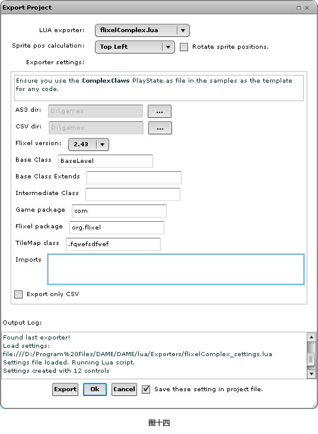
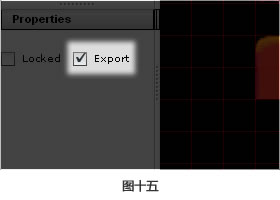
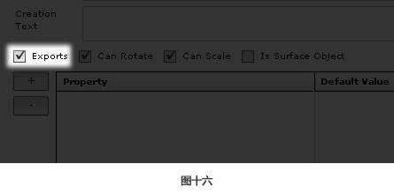
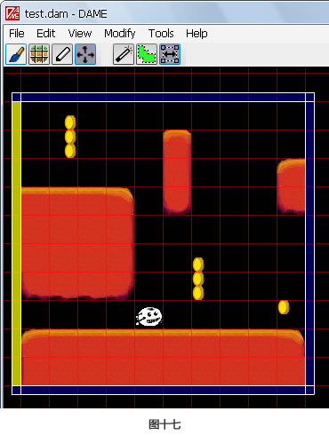
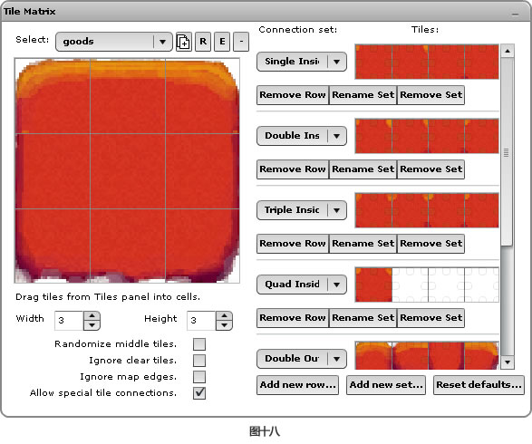
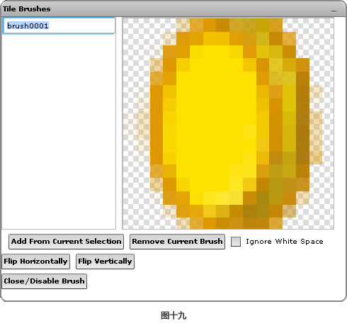

# 第二章节：DAME 系列教程

### 教程

- 如何安装 DAME（参见 chapter1 的安装方法）
- DAME 基础（参见 chapter3）
- Groups 与 Layers

下面将简要地解释一下下 Groups 与 Layers 的概念，以及在 DAME 中如何操作它们。
  
**规则**
  
1. group 是个容器，但它的含义还是取决于你游戏的定义和导出的接口。
2. 所有的层都必须包含在组中。
3. 每个层的类型都是为了同一个概念而设计的。不能把精灵放在地图层上，或者把形状放在路径层上。
4. 一个 tilemap 层只对应一个 tilemap 图片文件。
5.精灵层可以包含不同类型的精灵。

**概念**

在 DAME 中组织一个项目文件有很多方法。我试着列出以下几条：
  
1. 每个组一个场景，其中包含层中所有的地图和精灵。项目文件包含多个组，在开发过程中你可以打开.关闭组的可见性。为此，我建议看看定义接口是如何编写和组织起来的。
2. 一个项目一个组，你可以给每个关卡设置多个项目文件。找找 flixel 方面的例子，看看这种类型的层次结构是如何运作的。
3. 一个项目仅有一个组，那么这个组中将包含所有的东西。这是非常推荐的做法，除非你知让 tilemap 起作用，因为很难确定哪些精灵层与地图层是相互联系的。

**Tips**

  如果你不小心在图层上找不着北了，在菜单栏上点击【View】【Center Layer】会把当前视角定位到图层的中心。另外关于图层对象可以使用F3和F2快捷键，或者从【View】菜单上选择【Find Next】和【Find Previous】查找和选择不同的对象。

- 导出接口
  
一旦完成了项目的编辑，你就可以从 DAME 中导出给自己用的代码了。导出的最终结果就是一个或者多个文本文件，但文本文件的实际格式是由亲自己决定的，它可能是 CSV、XML 或者其他的文件格式。你可以编写自己的接口，如果你是用 Flixel 或者 Flashpunk 创建自己的游戏，那么可以使用 DAME 内置的一些接口。

看看下面哪种情况更适合你：
  
####从 DAME 中导出代码
  
在这种情况下，DAME 可以为你导出一个初级的脚本类。你创建的 tilemap 层也会自动被设置，精灵也会创建好，包括在精灵对话框的【Constructor】区域定义的参数。下面可以开始写你的代码了：

  1. 处理碰撞检测与其他特殊情况的处理
  2. 移动以及绘制精灵

要想导出这种接口，可以从【File】菜单上选择【Export...】。接着从【LUA Exporter】下拉框菜单上选择【flixelSimple.lua】、【flixelComplex.lua】或者【flashpunk.lua】。如果是用 Flashpunk 编写游戏，当然你要选择【flashpunk.lua】。有两种Flixel接口，你只需要使用【flixelComplex.lua】就行了，如果你的项目中包含：

  1. 多级别(带升级的那种/闯关)
  2. 有路径/形状层
  3. 旋转或者缩放精灵

如果你有其他自定义的接口，它们也会出现在下拉列表中。一旦你选中了其中的一种接口，就会出现更详细的操作对话框(如图十四所示)。

| 导出项              | 含义解释 |
| :----------------   | :----------|
| AS3 dir | 导出已保存的脚本文件表 |
| Base Class |	导出从创建的类中继承的脚本类。比如：`com.dambots.MyLevel` |
| CSV dir | 从已保存的 tilemap 层中导出 CSV 格式的表 |
| Game package |	打包所有导出的类，成为 as 文件 |
| FlashPunk package |	在游戏目录中，为 FlashPunk 源码打包所有导出的类。你通常可以把它留作 `net.flashpunk` 即可 |
| Flixel package |	在游戏目录中，为 Flixel 源码打包所有导出的类。你通常可以把它留作 `org.flixel` 即可 |
| TileMap class  |	所有的 tilemap 层都将从这个类中继承，使用点记法输入，比如 `com.dambots.MyTilemap` |

点击【Export】按钮导出合适的文件。在 DAME 中，每导出一次，你都需要重新编译下项目文件看看其中的变化。

####从 DAME 中只导出 CSV 文件，用于我自己写好的代码

要从 DAME 中只导出 tilemap 层的 CSV 文件：

  1. 从【File】菜单选择【Export...】
  2. 从【LUA exporter】下拉菜单选择【flashpunk.lua】或者【flixelSimple.lua】
  3. 点击【CSV dir】后面的省略号按钮，选择 CSV 文件保存的位置
  4. 勾选【Export only CSV】复选框
  5.最后点击【Export】按钮

最终导出的 CSV 文件的格式名称将是这样的：`mapCSV_groupname_layername.csv`。同样每导出一次，你都需要重新编译下项目文件看看其中的变化。

####调整已导出的代码

亲可以对导出的层和精灵进行微调。要想防止整个层被导出，你可以在【Layers】选项卡中选定对象先，然后去掉下面【Properties】面板的上【Export】复选框前的对勾(如图十五所示)。

要想防止精灵被导出，可以在【Sprites】面板右键选择【Edit Sprite】。去掉【Exports】复选框前的对勾(如图十六所示)。

####导出错误

> 导出崩溃，在日志窗口中显示 #3013 错误。

这意味着 DAME 无法保存已导出的文件，由于现有的文件在覆盖时被锁定。通常来说，这是因为它们被其他的应用程序锁定了。如果你正在使用 FlashDevelop 编写代码，请尝试关闭并重新打开一次。

如果还有其他的错误，最好的方法就是查看输出的日志记录。

- Tile 基础编辑

####快捷方式/快捷键

在绘制模式时，切换当前 tile 元素有很多快捷方式，这些可是比较有用的哦亲~

通过键盘上的【,】(英文逗号)键可以选择当前 tile 左边的 tile 元素，用【.】(英文句号)键可以选择右边的。更 NB 的是，使用空格键可以选择当前光标下的 tile 元素。

进入选择模式，可以使用快捷键V。进入画笔模式可以使用快捷键B。

####调整和移动地图

DAME 一个很有用的特性就是可以实时地移动和调整 tilemap。要想调整或者移动 tilemap，先点击移动/调整地图小按钮，进入选择/移动模式。在 tilemap 四周，亲可以看到四个长方形。点击并移动其中的一边，就可以调整地图的大小。别担心，除非你调整后释放了手柄，否则 DAME 是不会毁坏你的地图的。就算毁坏了，亲不是还可以 Ctrl + Z 么？

要想移动地图，只要在地图珠区域单击并拖动即可。如果你对地图使用了【Snap To Grid(对齐到网格)】，那么移动只能按照 tile 元素的大小逐格移动了。否则，地图可以自由的拖移(如图十七所示)。

如果想移动精确的位置或者调整精确的大小，只需要在【Layers】面板上图的对象上右键选择【Edit Layer Info】，在弹出的对话框内设置各种属性相应的确切值即可。

####Tile Matrix(矩阵，类似九宫格)

在编辑 tilemap 时，Tile Matrix(矩阵) 可以节省时间。它可以让你定义 tile 元素如何在矩形中被放置。如果不想手动在地图的每个角落进行绘制，亲可以自己设定一个 Tile Matrix(矩阵)，向下拖动并放大。在一个项目中，你可以设置任意多的这样的矩阵，每个都可以由很多 tile 元素组成。想制作一个 Tile Matrix(矩阵)：

  1. 首先选中 tilemap 层，然后点击工具栏上的 Tile Matrix 图标，就在选择图标的右边(如图十八所示)。
  
  2. 一般，矩阵默认的大小是 3 * 3：每个角有个 tile 元素，每条边有个重复的 tile 元素。通过改变【Width】和【Height】区域的值，可以设定矩阵的尺寸。
  3. 从 Tiles 调色板把 tile 元素拖进矩阵，可以设置 tile 矩阵的组成。
  4. 点击 Tile Matrix(矩阵) 右上角的R按钮可以为矩阵重新命名(点击 E 按钮可以擦除矩阵中的tile元素，点击加号按钮可以拷贝出新的矩阵，减号是删除矩阵)。

一旦 Tile Matrix(矩阵) 被选中，你就可以在通过【Tile Matrix】对话框中的矩阵在 tilemap 中绘制矩形了。可以亲自己还要稍加润色。要想关闭矩阵并回到正常的绘制模式，可以点击工具栏上的绘画笔刷，或者按下键盘上的 B 键。

####Brushes(笔刷)

DAME 中的笔刷可以把 tile 元素分组，更方便地在 tilemap 中使用。笔刷与 Tile Matrix(矩阵) 的不同之处在于，笔刷通常是大小一致的，而 Tile Matrix(矩阵) 可以绘制任意大小的矩形。如果想创建一个笔刷：

  1. 先选中 tilemap 层，然后用在任意位置绘制的 tile 元素作为笔刷。
  2. 选择已经绘制好的 tile 元素。请记住，任何覆盖其附近的空的 tile 元素都能保存为笔刷的一部分。
  3. 从【Tools】菜单选择【Tile Brushes】。
  4. 在弹出的对话框中选择【~~Add~~ Create(2.1.4版本是 Add，原文是 Create) From Current Selection】按钮。
  5. 这时，你的新笔刷将被命名为 “brush 1”。点击(是单击)对话框左边的列表，可以给笔刷起个新的名字(如图十九所示)。
  

点左键时，画笔工具就可以绘制你的整个笔刷了。要想关闭笔刷回到正常的绘制状态，可以再次选择【Tools】菜单下的【Tile Brushes】，确保它是非锁定状态。

####Tile 绘制

我知道一些绘制 tile 的软件，比如 “Tile Studio” 和 “Tiled”。还有其他的扩展插件么？现在的情况就是如何制作和使用 tiles，以及从哪里获得 tileset。我本人使用 “the Gimp”。有什么方法把一张图片拼接成 tiles，拼接完以后在怎么办呢？哥哥我也是百思不得其解呀！

附：GIMP是虾米？ 
[维基百科关于GIMP的介绍](http://zh.wikipedia.org/wiki/GIMP) (中文) 
[GIMP官方网站](http://www.gimp.org/) (英文) 
[《GIMP视频教程》(Meet the GIMP)](http://www.verycd.com/topics/2848759/) (英文) 
[GIMP用户手册](http://docs.gimp.org/2.2/zh_CN/) (中文)

###编写/导出接口

- 带动画的 tile 元素

要导出带有动画效果的 tile 元素，你需要在 Lua 脚本中的每个地图层中调用下面的函数(不含回车)：

>DAME.CreateTileDataText( mapLayer:Object, keywords:String, tileframeKeywords:String, 
>animFrameSeparator:String):String

这个函数将会生成关于每个 tile 元素的属性和动画效果。Keywords 用于每个 tile 元素的文本。TileFrameKeywords 用于每个动画的帧。如果使用了 `%separator%` 关键字，那么 animFrameSeparator 文本将分离每个单独的帧。要想更深地了解关于接口的关键字，可以参考 DAME 的帮助文档，或者参考上面的导出接口。

下面是当调用 DAME.CreateTileDataText 时可用的关键字：

| 关键字 | 释义 |
| :---------------- | :----------|
| AS3 dir | 导出已保存的脚本文件表 |
| %fps% |	动画的帧率 |
| %name% |	动画的名称 |
| %numframes% |	动画的帧的名称 |
| %tileframes% |	输出动画的每个帧的文本 |
| %%if tileanims%% |	如果层中的存在动画效果的 tile，则此关键字仅输出包含的文本 |
| %%endif tileanims%% |	终止 `%%if tileanims%%` 逻辑关键字块 |
| %%if tileanim%% |	如果有动画效果起始于当前的 tile 元素，此关键字用于解析输出包含的文本 |
| %%endif tileanim%% |	终止 `%%if tileanim%%` 逻辑关键字块 |

tile 动画的每个帧也有它自己的关键字：

| 关键字 | 释义 |
| :---------------- | :----------|
| %frame% |	当前帧的序号，起始值是 0 |
| %frame1% |	当前帧的序号，起始值是 1 |
| %tileid% |	当前帧上的 tile 的 ID |
| %separator% |	通过 `animFrameSeparator` 参数输出指定的独立文本 |

###其他教程

下面是其他网站提供的一些教程。如果想学会进阶教程，亲可以看看其他人的网站或者博客。

  - Producerism 的 DAME 教程(英文)： 
  [Part 0 - Review of Engines and Map Editors](http://producerism.com/blog/flashpunk-dame-and-lua-tutorial-part-0/) 
  [Part 1 - Project layout](http://producerism.com/blog/flashpunk-dame-and-lua-tutorial-part-1/) 
  [Part 2 - DAME Map "Templates"](http://producerism.com/blog/flashpunk-dame-and-lua-tutorial-part-2/) 
  [Part 3 - Map XML Format](http://producerism.com/blog/flashpunk-dame-and-lua-tutorial-part-3/) 
  [Part 4 - Lua Export Script](http://producerism.com/blog/flashpunk-dame-and-lua-tutorial-part-4/) 
  [Part 5 - AS3 FlashPunk Basics](http://producerism.com/blog/flashpunk-dame-and-lua-tutorial-part-5/) 
  [Part 6 - Tilemap and Grid Class](http://producerism.com/blog/flashpunk-dame-and-lua-tutorial-part-6/)

  - Jumper 项目(英文)： 
  [第一部分](http://chipacabra.blogspot.com/2010/12/project-jumper-part-1.html) 
  [第二部分](http://chipacabra.blogspot.com/2010/12/project-jumper-part-2.html) 
  [第三部分](http://chipacabra.blogspot.com/2010/12/project-jumper-part-3.html)

  - Mathew Casperson 的教程(英文)： 
  [用 DAME 创建一个 Flixel 场景](http://www.brighthub.com/hubfolio/matthew-casperson/blog/archive/2011/02/01/creating-a-flixel-level-with-dame.aspx)
