# 第三章：DAME 操作基础

这个教程将向你展示如何在 DAME 中创建一个 tilemap 和 sprite 层。

**Tilemap** 就是可以直接浏览的一系列tile(译作“瓷砖”)元素的集合。在一张 tile 地图中，所以的单个元素尺寸必须保持一致。但在一个 DAME 项目文件中，你可以使用不同尺寸的 tile 地图。tilemap经常被用于创建大型的游戏场景或平面地图等。

**Sprite(精灵)** 作为一个单独的对象，可以放置在地图的任何位置。通常来说，玩家控制一个单独的精灵，可以与场景中的其他物体产生互动。精灵经常附带着动画效果，而 tilemap 却没有；精灵可以旋转或者被缩放，但 tilema 不行。

### 创建项目/工程文件

启动 DAME 软件，从【File】菜单选择【New】(如图一所示)，创建一个新的项目/工程文件。

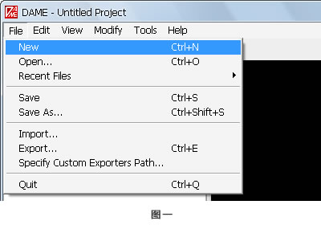

## 创建 Group(组) 和 Tilemap

首页，在 DAME 窗口中，确保【Layers】选项卡是打开的，而不是旁边的【Sprites】选项卡。如果不是，请点击左侧窗口中的【Layers】选项卡。现在，在【Layers】窗口中右键鼠标，选择【Add New Group】(如图二所示)。

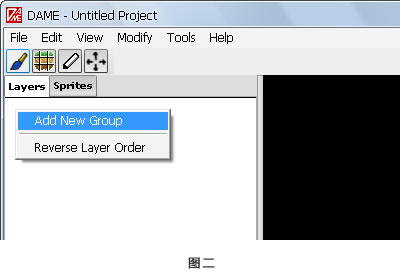

这时，会弹出一个新的对话框，你可以选择创建图层的类型。一个 group 就是互相联系的图层的集合；在一个项目文件中，你可以创建任意多的 group。现在，在 map 前的复选框内打勾，然后再点击下方的【OK】按钮(如图三所示)。

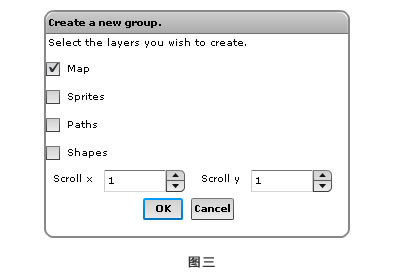

接下来，会出现一个【Layer Properties】(图层属性)对话框(如图四所示)，你可以修改关于 map 图层的更多信息。大多数的属性值可以保持默认值，但是你要根据自己的需求，把 tileset(图像)导入到 DAME 中。tileset 实际上只是个图片文件(通常是 PNG 格式)，其中包含着挨个排列的 tile 元素(当然，DAME 本身也可以创建 tileset，在此我们先不作讨论)。

1. 点击【Tileset】文本框后面的省略号按钮，从本地导入自己需要的 tilemap。
2. DAME 将会自动检测每个 tile 的尺寸，从而确保【Tile Width】和【Tile Height】的值是刚好合适的。如果你的 tileset 文件中包含多行 tile，DAME 给定的值不一定就是正确的。
3. 输入你的 tilemap 的宽度和高度值，这里的值是你的 tilemap 上的 tile 的宽和高的数量，**而不是以像素为单位的地图尺寸**。
4. 确认输入的【Draw Index】和【Collide Index】的值合适。小于【Draw Index】的值在 tiles 当中将不会出现；小于【Collide Index】的值在游戏进行碰撞检测时也将不会被考虑进去。这些值的设置取决于 tileset 图像中的 tile 元素。**请记住，tile 的初始值是 0，而不是 1**。
5. 利用【Scroll Factor X】和【Scroll Factor Y】设置的数值，可以在背景图中做出 parallax effect。这些数值是相对于游戏镜头的移动，以小数为单位的。举个栗子来说，把滚动数值设置为 1，代表图层是正常移动的，那么 10 像素就表示相机镜头是以每 10 像素为单位移动的。当滚动数值设置为 0.5 就表示以一半的速度移动：相机镜头每移动 10 像素，就代表了 5 个像素。滚动数值设置为 0 时，意味着不管游戏镜头如何移动，图层始终停留在相同的位置上。

  ####附：Parallax effect 是什么？ 
    - [维基百科解释](http://en.wikipedia.org/wiki/Parallax_scrolling)  
    - [网页设计发展趋势之 Parallax Scrolling](http://www.snl.cn/2008/products/1752.html)  
    - [百度文库](http://wenku.baidu.com/view/add26782d4d8d15abe234ed7.html) (英文) 
    - [效果展示一](http://www.charliegentle.co.uk/) 可以看到网页中左右移动的内容，其移动速度是不一样的 
    - [效果展示二](http://themeforest.s3.amazonaws.com/116_parallax/tutorial-source-files/tut-index.html)可以看到在切换 tab 的过程中，背景上的白云移动速度是不同的

6.  点击最下面的【OK】按钮，创建 tilemap 图层。如果想修改其中的任何数值，只需选中 map 层，右键选择【Edit Layer Info】即可。 
  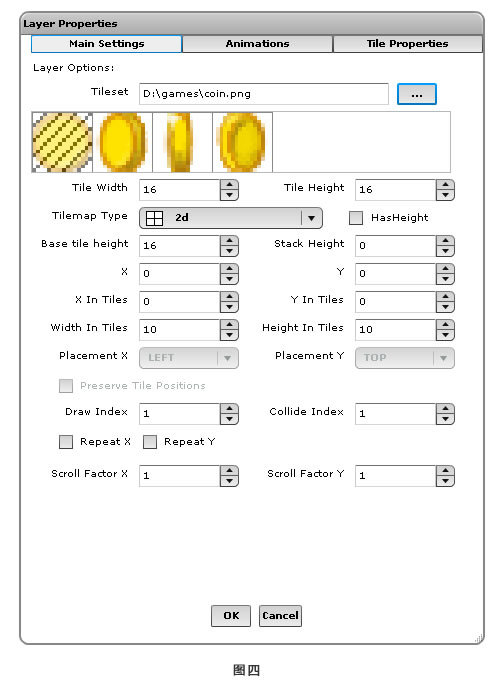

### 重命名 map

通过以上的步骤，我们已经创建了一个名为【Map1】的图层，可是在实际项目中如果图层太多，类似的图层命名可不是个好习惯。想对其重命名，只要在 map 图层上右键选择【Rename】即可(如图五所示)。 
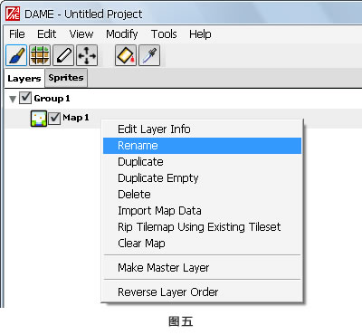

在弹出的对话框中，输入新的名称(如图六所示)，点击【OK】按钮。 
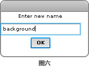

想要对 group 重命名，同样执行以上操作即可。

### 编辑地图

当你选中一个 tilemap 层时，会出现 tile 调色板(新版本中在 DAME 右下角有个【Tiles】按钮，点击即可显示)。这个调色板主要用于 tiles 的选择，使用鼠标的左/右键，你可以对 tiles 进行添加/删除操作。当你的鼠标划过其中一个 tile 的时候(如图七所示)，tile 的 ID(或者说是序号) 就会出现在 tiles 的状态栏上。特别是被 tileset 中的碰撞或者可见性困扰的时候，这种方法是很有帮助的。 
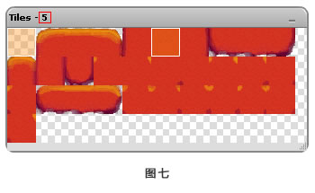

如果你把 tiles 调色板最小化，它将会显示早右下角的状态栏上，再点击一次，它又会出现。是不是很神奇啊亲？

编辑 tilemap 层主要有两种模式：绘制与选择。在两者之间切换最简单的方法就是单击工具栏上的图标(如图八所示)。 
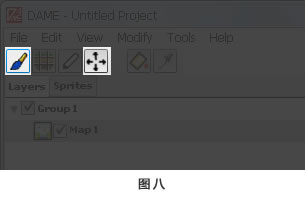

当然，亲也可以使用快捷键啦~ B 键是切换至绘制模式，V 键是切换至选择模式。

用鼠标左键从调色板中选择一个 tile，然后在右边的 map 层的空白处点击下，就可以开始绘制 tiles 了。在绘制时，有小技巧的哦亲~ 按住 X 键，同时挥动你手中的笔刷，可以看到出现的 tiles 都是横向排列的。同样，按住 Y 键出现的将都是竖向排列。

在选择模式下，亲可以复制和粘贴 tiles，或者大面积擦除 tiles。在选择模式里，在 tilemap 中点击时你可以看到一个矩形选框。拖动鼠标就能移动选择的 tiles，亲要想 fei 一般的感觉，可以选择菜单栏上的【Edit】选项，对 tiles 进行剪切、拷贝和粘贴操作。要擦除选中的 tiles，狂按你那熟悉的 Del 键就行了。

关于选择模式，亲要牢记的重要一点就是，以上的操作对于遮罩工具也是同样试用的。当选择模式出于激活状态，那你你就只能出于这个状态了。要想不删除任何内容并离开选择模式，可以从【Edit】菜单上选择【Select None】，或者是快捷键【Ctrl+D】，亲可能已经看到了。

移动地图时，你可以拖动滚动条调整当前视图的位置，或者按住 Ctrl 键，并按下键盘上的方向键，也是可以滴。 
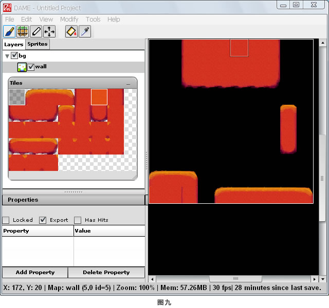

亲~ 真心希望你完成的 tilemap 比我上面的截图(如上面图九所示)更好！

### 编辑 Sprites

接下来，让我们往项目上添加一些 sprites 吧，少了演员可不行。作为 sprites，需要从 tilemaps 中独立出来，作为单独的层，因此，在 group 层上右键选择【Add】-【New Sprite Layer】(如图十所示) 
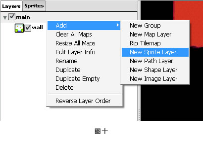

然后，对精灵层右键选择【Rename】，给它重新起个名字。但至此我们除了定义了一个新的精灵外，其他的什么都还没做。选择 DAME 窗口左侧的【Sprites】选项卡(跟【Layers】挨着的)，在选项卡下面的【Sprites】上右键选择【Add Anim Sprite】(如图十一所示)。 
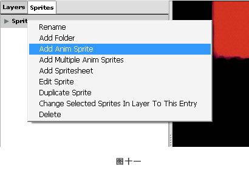

从右键的菜单上可以看到，我们可以创建不同种类的精灵。动画精灵是其中最简单的一种，是由一个单独的精灵图像组成，并包含着动画帧。

一旦你选择了创建一个动画精灵，DAME就会弹出一个【Assign Sprite Data】对话框，里面有关于它的详细信息。

  1. 【Name】区域就是设置精灵在 DAME 中的名称。
  2. 【Class】区域就是设置精灵在代码中的类的名称，从而在 DAME 中导出。类的名称只能由字母和数字组成，**不能包含空格**，比如这几个栗子：Player, KillerBee, Rhododendron5。
  3. 点击【Image】区域后面的省略号按钮，可以选择精灵表文件。从本地选择一张图片，你就可以在下面的预览区域看到。
  4. 像 tilesets 一样，DAME 也会自动检测动画精灵的尺寸。你可以在【Width】和【Height】区域中调整尺寸，这些尺寸是以像素作为单位的。
  5. 调整对话框左侧的【Index】区域中的值，可以预览选导入的动画精灵的序列(初始值0表示第一张小图，如图十二所示，预览到的是第 5 张小图)。
    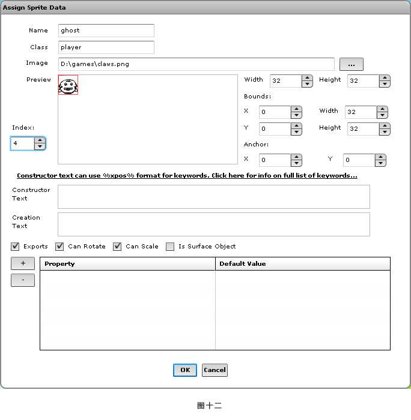
  6. 点击【OK】按钮，创建一个新的精灵。

现在，亲可以像绘制 tilemap 那样绘制自己的 sprites 了。绘制笔刷和选择模式也同样适用于 sprites，具体操作与编辑 tilemap 是一样一样的。

也许，你想像 tilemap 那样，把精灵按照网格排列(如图十三所示，红色的网格线)。通过【View】菜单下的【Change Grid Settings】，就可以更改网格的具体设置。当然，在选择 tilemap 层以后，也可以对网格进行设置，通过【View】菜单下的【Align Grids to Current Layer】设置即可。在以上两种情况中，通过【View】菜单下的【Snap To Grid】可以切换网格的对齐方式。tilemap 经常是与它们的 tile 元素尺寸是对其的。

也许你做好的一个项目文件就像下面这样：

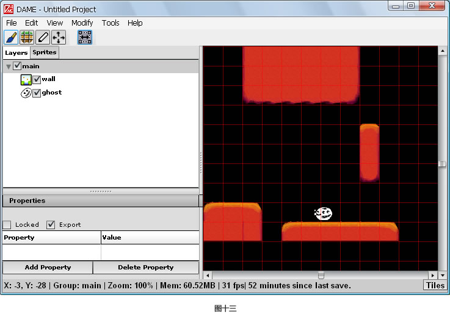
