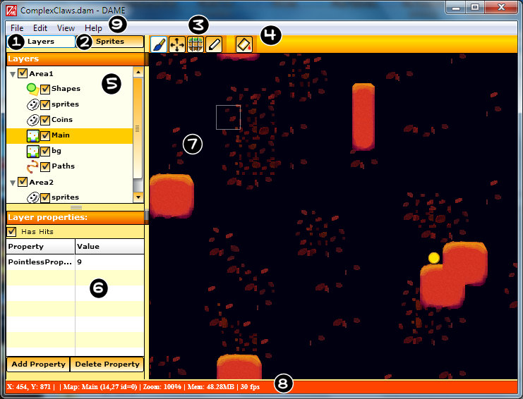

# 第四章：DAME 基础操作

### DAME 主窗口

下面是 DAME 主窗口的一张截图，其中标识了主窗口的一些相关信息。

  1. 【Layers】选项卡 - 点击此按钮将在面板区域显示图层面板
  2. 【Sprites】选项卡 - 点击此按钮将在面板区域显示精灵面板
  3. 编辑模式工具栏 - 点击这些按钮可以在主要的编辑模式之间进行切换
  4. 当前编辑工具栏 - 点击这些按钮可以根据当前编辑模式或者选择的对象进行切换
  5. 面板区域 - 显示图层面板或者精灵面板
  6. 属性栏 - 当编辑 tilemap 或者对象时，显示当前项目的属性
  7. 主区域 - 这里是地图展示区，以及显示所放置的对象
  8. 状态栏 - 显示一些诸如当前鼠标的 x/y 坐标以及上次保存项目的时间
  9. 主菜单 - 通过它们改变显示/编辑功能，还有保存、导入和导出等等功能

###导航

关于 DAME 中地图的操作，有很多方法：

  1. 在主区域按住鼠标中键可以拖动视图范围
  2. 在主区域同时按住键盘 “D” 键和鼠标中键可以以一定的速率拖动视图范围
  3. 使用 Ctrl 键和方向键配合可以移动视图
  4. F2 键可以在当前层中移动/选择到上一个对象(如果操作有效)
  5. F3 键可以在当前层中移动/选择到下一个对象(如果操作有效)
  6. Ctrl + L(或者通过主菜单的【View】【Center Layer】) 可以将视图移动到当前层的中心位置
  7. 滚动鼠标滚轮可以放大/缩小主区域

###转换

DAME 支持三种类型的转换：

  1. 移动 - tile 元素和所有的对象都支持这一类型
  2. 旋转 - 只有对象才支持此类型
  3. 缩放 - 只有对象才支持此类型

只有当对象周围出现虚线框时才可以使用转换，对于 tilmap 也是一样。通常情况下，在选择模式选择对象或者 tile 元素时，才使用这些转换类型，具体做法是点击选择图标。

###网格与限性

通过主菜单上的【View】【Grid】(Ctrl + G 组合键)可以显示网格。

显示网格并不意味着你移动或者添加的对象将会对齐到网格。如果想对齐到网格，请通过菜单上的【View】【Snap To Grid】(Ctrl + Shift + G )来操作。

_完结，以后不会有更新。_
